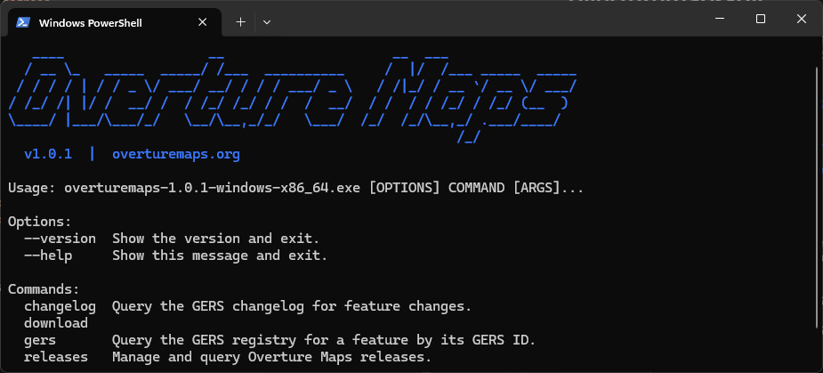

[](https://pypi.org/project/overturemaps/)
[](https://anaconda.org/conda-forge/overturemaps)
[](https://formulae.brew.sh/formula/overturemaps)
[](https://github.com/OvertureMaps/overturemaps-py/releases/latest)
[](https://github.com/OvertureMaps/overturemaps-py/releases/latest)

# overturemaps-py

<p align="center">
  
</p>

Official Python command-line tool of the [Overture Maps Foundation](https://overturemaps.org).

Overture provides free and open geospatial map data, from many different sources and normalized to a
[common schema](https://github.com/OvertureMaps/schema). This tool helps to download Overture data
within a region of interest and converts it to a few different file formats. For more information about accessing
Overture data, see the [official documentation site](https://docs.overturemaps.org).

## Installation

Install with pip:

```bash
pip install overturemaps
```

Also available via:

```bash
# Homebrew
brew install overturemaps

# conda-forge
conda install -c conda-forge overturemaps

# uvx
uvx overturemaps download --bbox=-71.068,42.353,-71.058,42.363 -f geoparquet --type=building -o boston.parquet
```


## Quick Start

Download building footprints for a bounding box as GeoParquet:

```bash
overturemaps download --bbox=-71.068,42.353,-71.058,42.363 -f geoparquet --type=building -o boston.parquet
```

## Commands

The CLI includes these top-level commands:

- `download`: download Overture data, optionally clipped to a bounding box.
- `gers`: look up a single feature by GERS ID.
- `releases`: inspect available Overture releases.
- `changelog`: query GERS feature changes across releases.

Run `overturemaps --help` for the full command tree.

## Documentation

- [CLI guide](docs/cli.md)
- [Python API guide](docs/python-api.md)
- [Performance notes](docs/performance.md)
- [Contributing guide](CONTRIBUTING.md)
